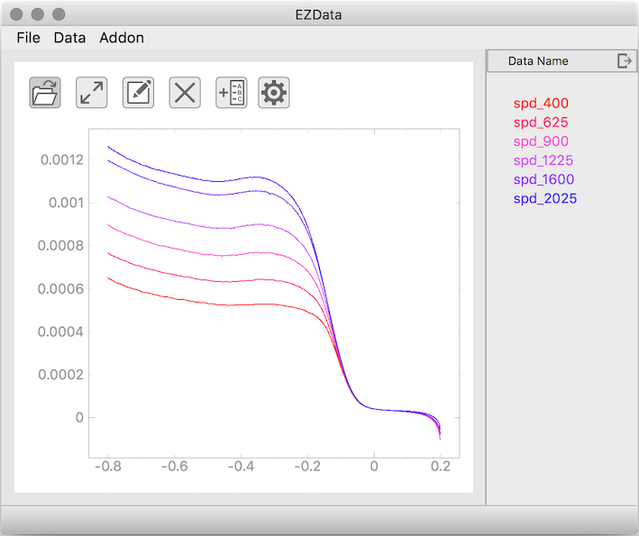

# EZData



## Introduction

This is a handy GUI application for processing electrical chemistry data. It is written in pure python supported by `PyQt5` and `pyqtgraph`. The code supports all platforms but the packaging only support macOS.

## Use the app

Please install the dependency by

```
pip3 install -r requirements.txt 
```

You can run the app by

```
cd src
python3 ezdata.py
```

## Package the app

If you are using macOS, you could execute this in the root folder

```
python3 setup.py py2app
```

This would generate a `.app` file in the folder `dist`. You can use this app as a normal macOS app, dragging it into the `Applications` folder.

If packaging the file failed, you could also try to use

```
python3 setup.py py2app -A 
```

The generated app is not a normal macOS app. You should leave it  at the `dist` folder, and dragging its alias to the `Applications` folder.